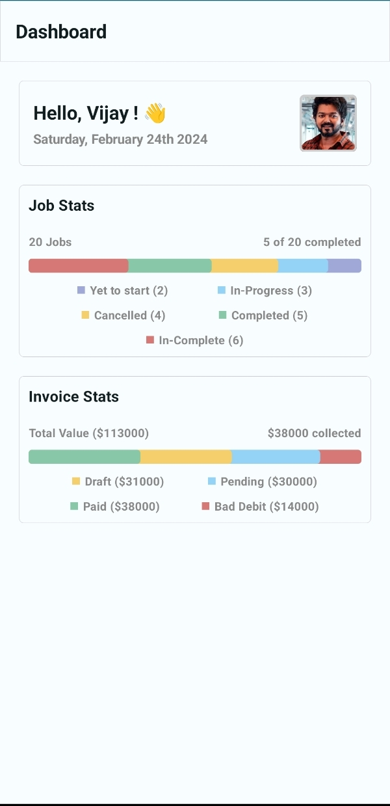

# Zuper DashBoard

## Features

* **Single Activity:** Built with a single activity architecture for simplicity and performance.

* **Jetpack Compose:** Utilizes Jetpack Compose for a modern and declarative UI development experience.

* **Kotlin:** Developed entirely in Kotlin, taking advantage of its concise and expressive syntax.

* **Dagger Hilt:** Uses Dagger Hilt for dependency injection, making the codebase modular and maintainable.

* **Clean Architecture:** Follows clean architecture principles to promote separation of concerns and maintainability.

* **Custom Dashboard UI Chart:** Incorporates a custom-designed dashboard UI chart to present data in an intuitive and visually appealing way.

